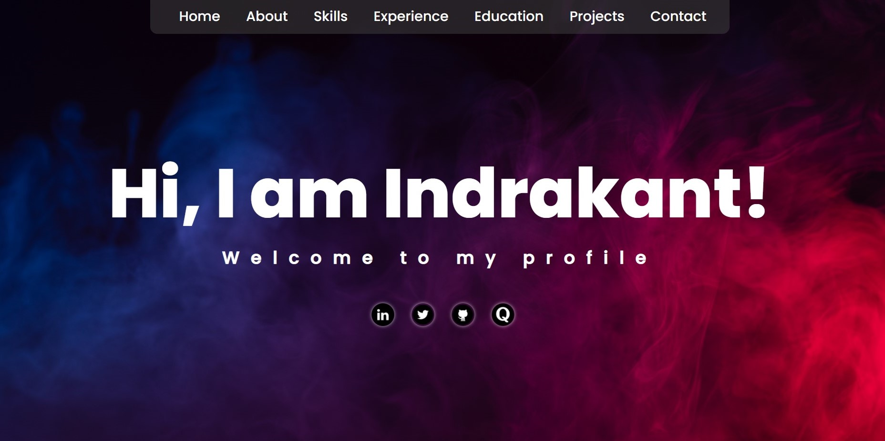

# My First Portfolio Website

This is my first Portfolio website made only using HTML and CSS.
This is a part of my Full-Stack Web Development Course 🧑‍🎓.
Please have a look and take some time to appreciate it
as well. 😊😄

## Some Glimpse of the website

*You can visit 👉 [here](https://indrakant-dana.github.io/)
to view my website.* 💛

## 
**Reminder:** This Website is made only
using HTML and CSS only. 
Some functions are not working, will correct them soon:
* The Form section doesn't work as I 
don't have knowledge of the backend yet 😞. I will fix that
soon. Till that time, you have to wait 🙏.
* Also the website is made on a 14-inch laptop. So, there might be some CSS issues with the website on smaller or larger screens. Working on the responsive design part too. Appreciate your patience.😊
